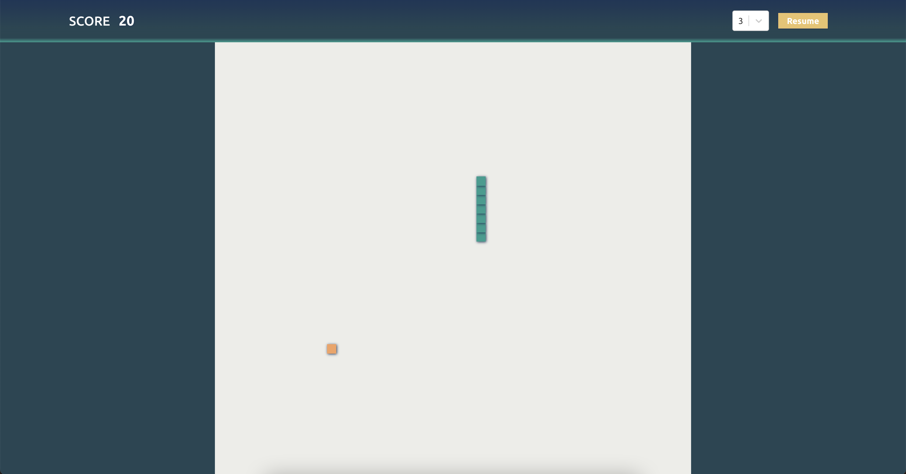

# Snake Game built with React.js

This project aimed to reproduce famous Snake game using React.js.

## Concepts used

    - Create a game loop using useEffect with clean-up function;
    - Listen to user key inputs with useEffect (componentDidMount, componentWillUnmount);
    - useReducer for advanced component state management;
    - Rendering lists in React;
    - Conditional rendering;
    - Positioning elements with CSS grid properties;
    - Create portals for a modal component;
    - Lifting state up to parent component;
    - Working with React-select package;

## Screenshot

